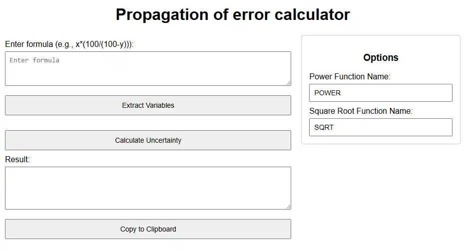

# PropagationOfError

[poe.krzsztf.com](https://poe.krzsztf.com/)

web-based tool that generates the propagation of error formula from a user-provided mathematical expression

It extracts variables from the expression and lets the user select which variables have associated uncertainties. The application then symbolically computes the partial derivatives, forms the squared error terms, and outputs the overall error propagation formula.

The tool uses `Math.js` for parsing expressions and differentiating with respect to each variable.

## Usage

1. Enter your formula (e.g., `x*(100/(100-y))`).
2. Click the "Extract Variables" button to display the variables found.
3. Select the variables that have uncertainties.
4. Click the "Calculate Uncertainty" button to generate the propagation of error formula.

## Options

Customize the names of the power and square root functions (e.g., `POWER` and `SQRT`) via the sidebar options.
